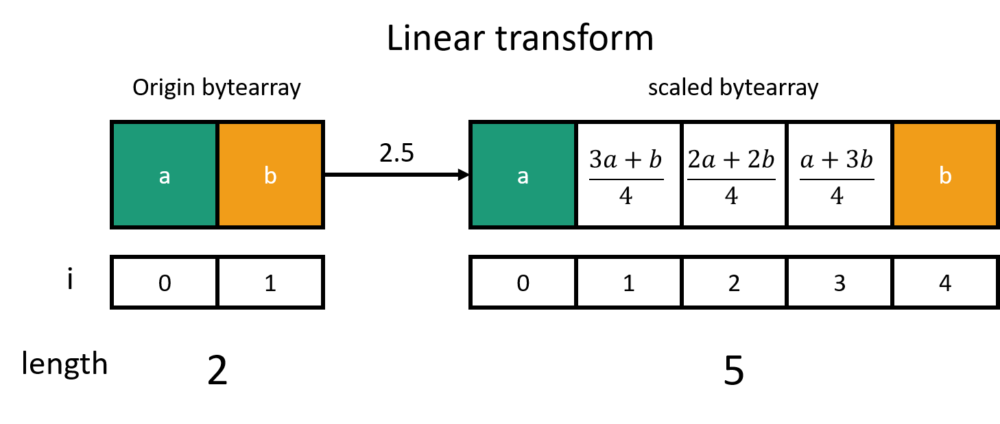
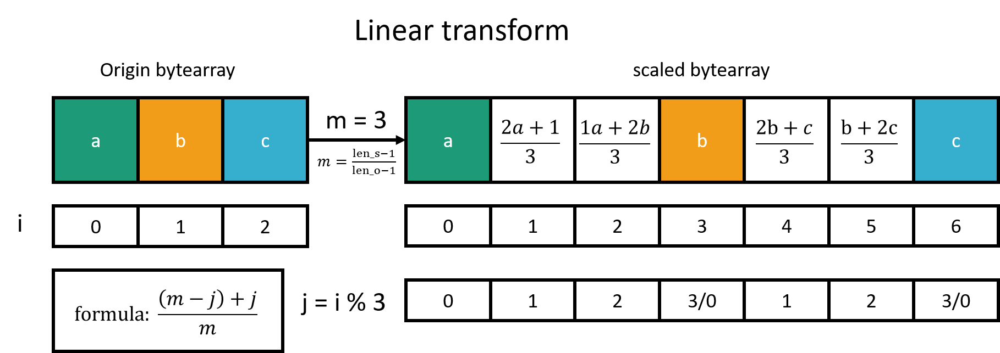

# x86-Assembly-Video-To-Ascii

### 初次使用

請在終端機中取消追蹤以下兩個檔案  
`git update-index --assume-unchanged .\.vs\Video2Acsii\v16\.suo`  
`git update-index --assume-unchanged .\.vs\Video2Acsii\v16\Browse.VC.db`

### 圖片縮放
- Goal : 將圖片寬放大 1.8(9/5) 倍
- 原理: 使用到插植法，這邊長度沒-1，下面會講 

擴充: **記得在計算長度時要-1**

處理 index 的部分需要留意 j 當頭尾

Goal : 所以圖片長(這邊有-1)從 4 -> 8 (m=2)
